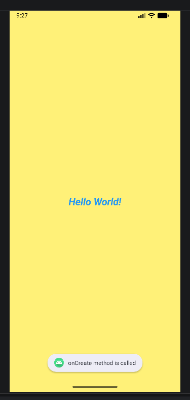
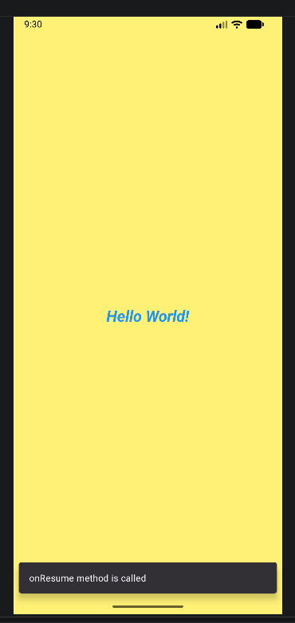
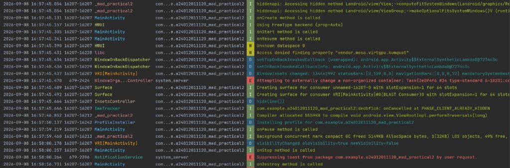

# Practical-2: Activity Life Cycle and Basic UI

**Student Enrollment Number:** 24012011120  
**Course:** Mobile Application Development (MAD)  
**IDE:** Android Studio  

## Aim
Create an Android application to demonstrate the functions of Activity Life Cycle and Basic UI.

## Description
This practical demonstrates the different stages of the Android Activity Life Cycle and displays messages using Snackbar and Toast.

## Activity Life Cycle Methods
- onCreate()
- onStart()
- onResume()
- onPause()
- onStop()
- onRestart()
- onDestroy()

## Features
- Displays **Snackbar message** when the application is started.
- Displays **Toast message** when the application is reopened.
- Displays Activity Life Cycle methods in **Logcat**.

## Output

### Snackbar Message

### Toast Message

### Logcat Output

## Conclusion
The application successfully demonstrates the Activity Life Cycle along with Snackbar and Toast messages.
